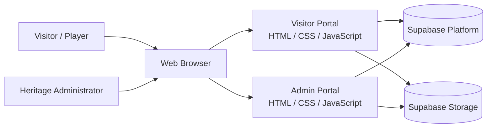
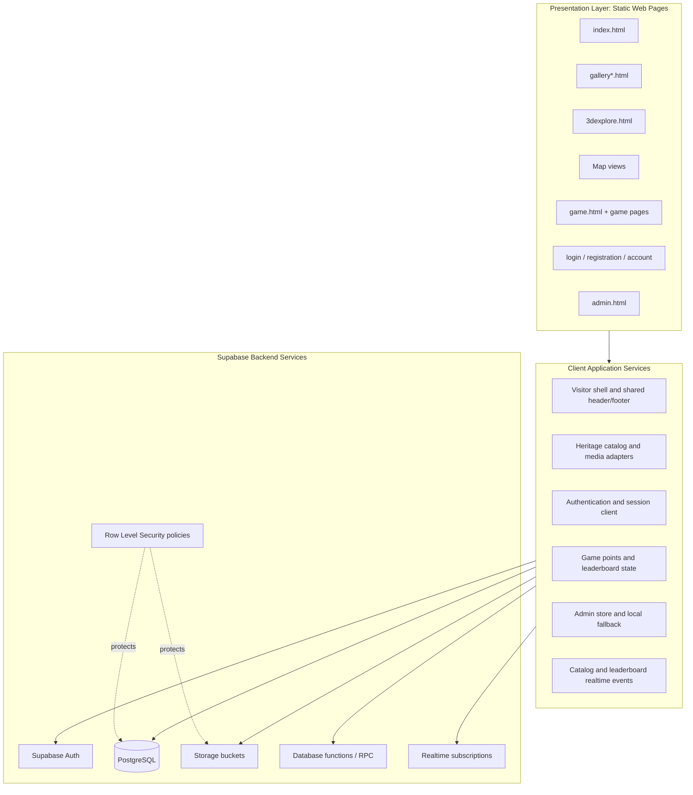
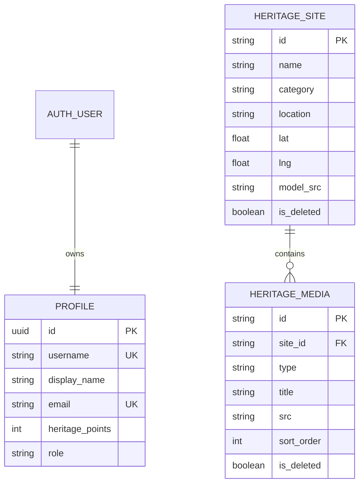
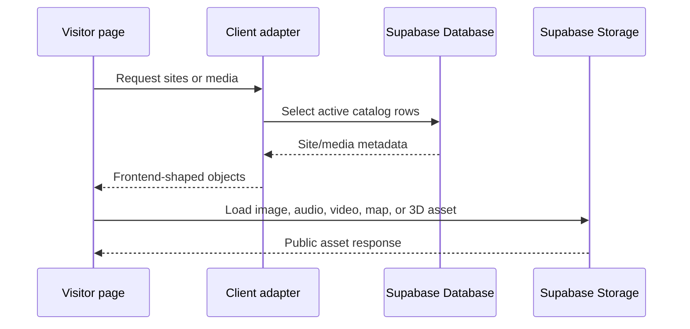
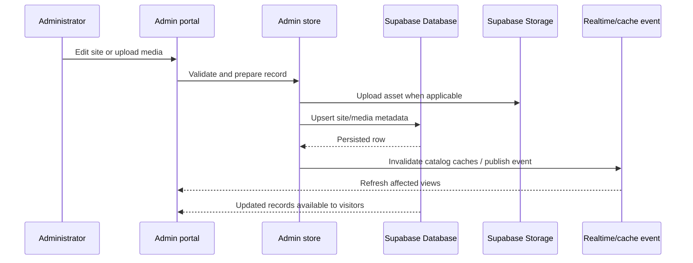
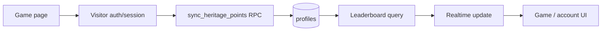
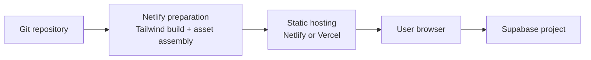
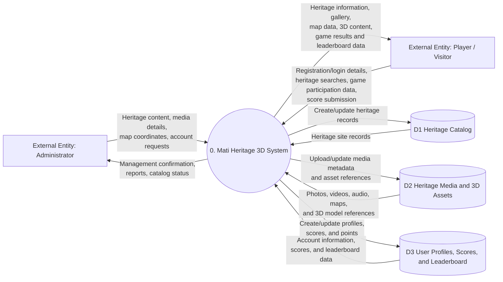

# Mati Heritage 3D System Architecture

> Working architecture baseline derived from the current implementation. The manuscript and BSIT guide were not available in the workspace during this first pass, so their terminology and required diagrams still need to be reconciled with this document.

## 1. System Context



The system is a browser-based heritage information, exploration, and gamification platform for Mati. It has two principal user roles:

- **Visitors / players** browse heritage sites, view media and 3D models, explore the map, and play games.
- **Administrators** maintain heritage site records, media, map coordinates, 3D assets, and operational reports.

## 2. High-Level Architecture



## 3. Main Components

| Component                  | Responsibility                                                               | Current implementation boundary                                      |
| -------------------------- | ---------------------------------------------------------------------------- | -------------------------------------------------------------------- |
| Visitor Portal             | Public heritage browsing and exploration                                     | `Front End/index.html`, gallery pages, `3dexplore.html`, map scripts |
| Games Portal               | Game selection, game sessions, points, and leaderboard experience            | `Front End/game.html` and individual game pages                      |
| Authentication UI          | Registration, login, password reset, account, and logout flows               | `Front End/auth*.js`, auth HTML pages                                |
| Admin Portal               | Site, media, map, upload, analytics, and catalog administration              | `Front End/admin.html` and `admin-*.js`                              |
| Supabase client            | Browser client creation and connection checks                                | `Front End/_backend/supabase-client.js`                              |
| Supabase API adapter       | Maps database rows to existing frontend objects and exposes data operations  | `Front End/_backend/supabase-api.js`                                 |
| Admin store                | Admin state, synchronization, local browser fallback, and cache invalidation | `Front End/admin-store.js`                                           |
| PostgreSQL database        | Profiles, heritage sites, media metadata, points, and leaderboard data       | `Back End/supabase/migrations/`                                      |
| Storage                    | Photos, maps, models, videos, audio, and avatars                             | Supabase Storage buckets                                             |
| Seed and migration scripts | Schema evolution and initial catalog/media population                        | `Back End/scripts/` and `Back End/supabase/seed/`                    |

## 4. Data Architecture



### Primary data rules

1. `heritage_sites` is the canonical catalog for built, natural, and intangible heritage.
2. `heritage_media` stores metadata and public URLs for site media, including 3D models.
3. `profiles` connects authenticated users to roles and heritage points.
4. Active records are exposed to visitors through public read policies; administrator writes are protected by role checks and RLS.
5. `is_deleted` supports soft deletion for media and catalog records where the frontend needs to retain synchronization history.
6. Browser storage remains a fallback/cache boundary for local development and offline-compatible admin behavior; it is not the shared source of truth for deployed visitor content.

## 5. Key Runtime Flows

### Visitor catalog flow



### Administrator publishing flow



### Game points and leaderboard flow



## 6. Deployment View



The frontend is deployable as static assets. Supabase is an external managed backend and must be configured separately through the browser configuration and backend environment variables. Database migrations, RPC functions, storage buckets, and seed files are deployment prerequisites for a fully functional installation.

## 7. Use Case Diagram

The Use Case Diagram identifies the main functional requirements of Mati Heritage 3D from the users' perspective. It shows who interacts with the system and the services each actor can perform. The system boundary contains the use cases provided by Mati Heritage 3D, while the actors remain outside the boundary.

```mermaid
usecaseDiagram
    actor "Visitor / Guest" as Visitor
    actor "Registered Player" as Player
    actor "Administrator" as Admin

    rectangle "Mati Heritage 3D System" {
        (Browse Heritage Sites) as Browse
        (Search and Filter Heritage) as Search
        (View Heritage Gallery) as Gallery
        (Explore Heritage Map) as Map
        (View 3D Heritage Models) as Models
        (Register Account) as Register
        (Login) as Login
        (Reset Password) as Reset
        (Manage Profile) as Profile
        (Play Games) as Games
        (Submit Game Score) as SubmitScore
        (View Scores and Leaderboard) as Leaderboard
        (Manage Heritage Sites) as Sites
        (Manage Media and 3D Assets) as Media
        (Manage Map Locations) as Locations
        (View Reports and Analytics) as Reports
        (Authenticate User) as Authenticate
    }

    Visitor --> Browse
    Visitor --> Search
    Visitor --> Gallery
    Visitor --> Map
    Visitor --> Models
    Visitor --> Register
    Visitor --> Login

    Player --> Login
    Player --> Reset
    Player --> Profile
    Player --> Games
    Player --> Leaderboard

    Admin --> Login
    Admin --> Sites
    Admin --> Media
    Admin --> Locations
    Admin --> Reports

    Login ..> Authenticate : <<include>>
    Register ..> Authenticate : <<include>>
    Games ..> SubmitScore : <<include>>
    Profile ..> Authenticate : <<include>>
    Sites ..> Authenticate : <<include>>
    Media ..> Authenticate : <<include>>
    Locations ..> Authenticate : <<include>>
    Reports ..> Authenticate : <<include>>
```

### Actors

| Actor | Role in the system |
|---|---|
| Visitor / Guest | Views public heritage information, searches the catalog, accesses the gallery, explores the map, and views 3D models. |
| Registered Player | Logs in, manages a profile, plays heritage games, submits scores, and views scores and the leaderboard. |
| Administrator | Maintains heritage sites, media and 3D assets, map locations, and administrative reports and analytics. |

### Use cases

| Use case group | Use cases |
|---|---|
| Public heritage access | Browse Heritage Sites, Search and Filter Heritage, View Heritage Gallery, Explore Heritage Map, View 3D Heritage Models |
| Account and authentication | Register Account, Login, Reset Password, Manage Profile, Authenticate User |
| Gamification | Play Games, Submit Game Score, View Scores and Leaderboard |
| Administration | Manage Heritage Sites, Manage Media and 3D Assets, Manage Map Locations, View Reports and Analytics |

The `«include»` relationships indicate required supporting behavior. For example, logging in includes user authentication, and playing a game includes submitting the resulting score. A Level 1 DFD can decompose these use cases into detailed processes such as catalog management, account management, game management, and reporting.

## 8. Level 0 Data Flow Diagram

The architecture diagram shows the technical environment. The Level 0 DFD below shows the major business data flows between the two external entities, the Mati Heritage 3D system, and its logical data stores.



### Level 0 DFD data-flow descriptions

| Source or destination                             | Data flow                                                                                | Purpose                                                                      |
| ------------------------------------------------- | ---------------------------------------------------------------------------------------- | ---------------------------------------------------------------------------- |
| Administrator -> Mati Heritage 3D System          | Heritage content, media details, map coordinates, account requests                       | Maintains the heritage catalog and system administration data                |
| Mati Heritage 3D System -> Administrator          | Management confirmation, reports, catalog status                                         | Confirms administrative actions and presents management information          |
| Player / Visitor -> Mati Heritage 3D System       | Registration/login details, heritage searches, game participation data, score submission | Allows users to access the portal, explore heritage, and submit game results |
| Mati Heritage 3D System -> Player / Visitor       | Heritage information, gallery, map data, 3D content, game results, leaderboard data      | Provides the system's public content and player feedback                     |
| System <-> Heritage Catalog                       | Heritage site records                                                                    | Stores built, natural, and intangible heritage information                   |
| System <-> Heritage Media and 3D Assets           | Media metadata and asset references                                                      | Stores and retrieves photos, videos, audio, maps, and 3D models              |
| System <-> User Profiles, Scores, and Leaderboard | Accounts, scores, points, and rankings                                                   | Supports authenticated players and gamification                              |

## 9. Quality and Security Boundaries

- The browser may contain only the Supabase anonymous key; service-role credentials belong exclusively in backend scripts or the Supabase dashboard.
- Public visitors can read active catalog and media records.
- Administrator operations require an administrator role enforced through database policies and `is_admin()`.
- Authentication sessions are persisted and refreshed by the Supabase client.
- Uploaded files are stored separately from relational metadata, with the metadata row retaining the public asset URL.
- A production hardening pass should remove or disable temporary anonymous admin-write policies once authenticated administrator writes are fully enabled.

## 10. Architecture Decisions to Confirm Against the Manuscript and BSIT Guide

1. Required system actors, use cases, and role names.
2. Required architecture notation: context diagram, component diagram, deployment diagram, or all three.
3. Whether the research scope treats games and leaderboard as core system modules or supporting features.
4. Required non-functional requirements: availability, performance, accessibility, security, maintainability, and mobile support.
5. Whether the manuscript requires a separate recommendation/reporting module beyond the current admin analytics.
